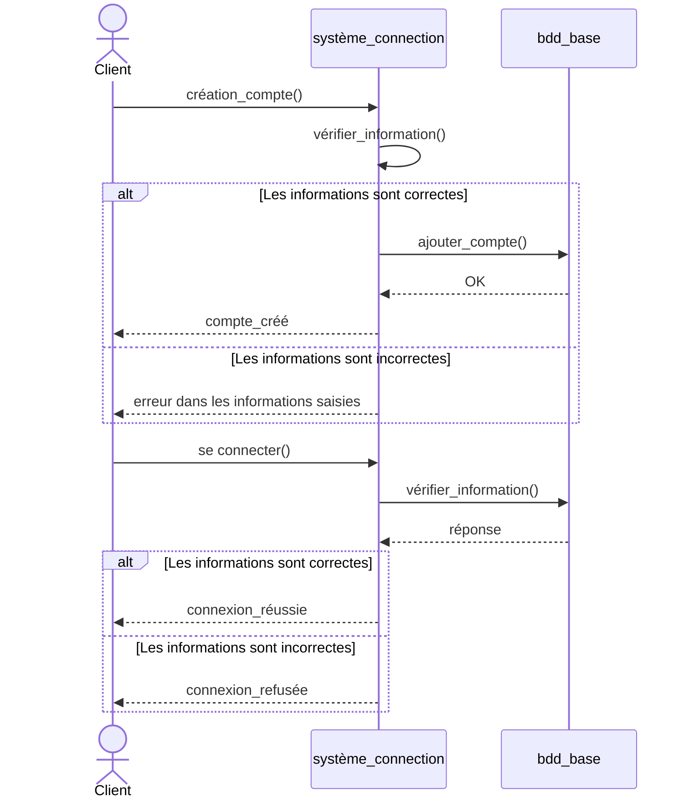
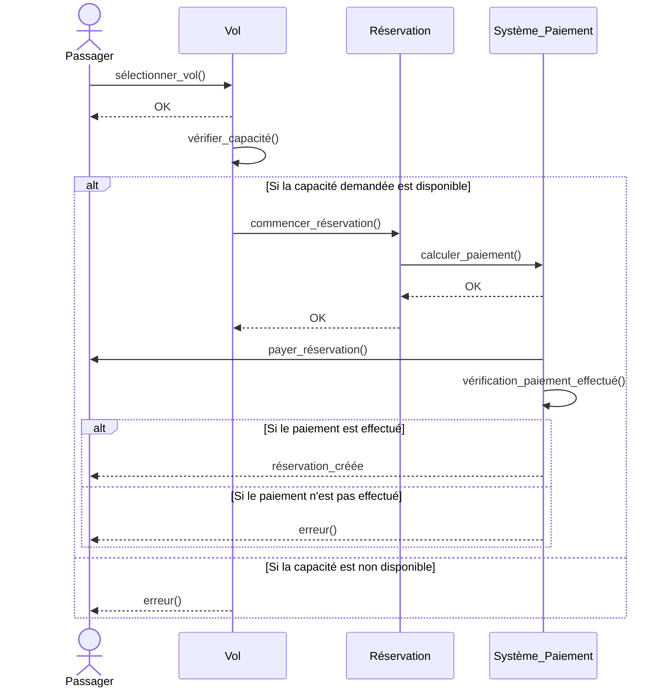

```mermaid
sequenceDiagram
    actor Client
    participant système_connection
    participant bdd_base

    Client ->> système_connection: création_compte()
    système_connection ->> système_connection : vérifier_information()

    alt Les informations sont correctes
        système_connection ->> bdd_base: ajouter_compte()
        bdd_base -->> système_connection: OK
        système_connection -->> Client: compte_créé
    else Les informations sont incorrectes
        système_connection -->> Client: erreur dans les informations saisies
    end

    Client ->> système_connection: se connecter()
    système_connection ->> bdd_base: vérifier_information()
    bdd_base -->> système_connection: réponse

    alt Les informations sont correctes
        système_connection -->> Client: connexion_réussie
    else Les informations sont incorrectes
        système_connection -->> Client: connexion_refusée
    end
    
```

```mermaid
sequenceDiagram
actor Passager
    participant Vol
    participant Réservation
    participant Système_Paiement

    Passager ->> Vol: sélectionner_vol()
    Vol -->> Passager: OK
    Vol ->> Vol: vérifier_capacité()

    alt Si la capacité demandée est disponible
        Vol ->> Réservation: commencer_réservation()
        Réservation ->> Système_Paiement: calculer_paiement()
        Système_Paiement -->> Réservation: OK
        Réservation -->> Vol: OK
Système_Paiement ->> Passager: payer_réservation()
        Système_Paiement ->> Système_Paiement: vérification_paiement_effectué()

        alt Si le paiement est effectué
            Système_Paiement -->> Passager: réservation_créée
        else Si le paiement n'est pas effectué
            Système_Paiement -->> Passager: erreur()
        end
    else Si la capacité est non disponible
        Vol -->> Passager: erreur()
    end
```